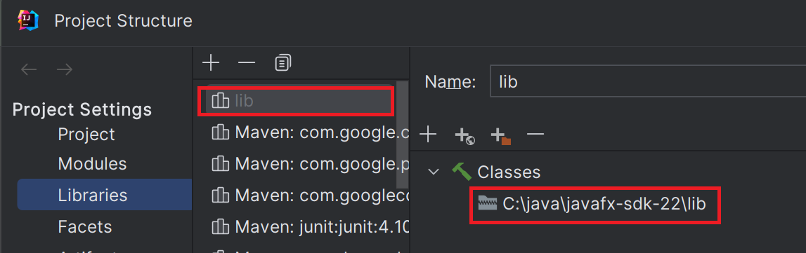
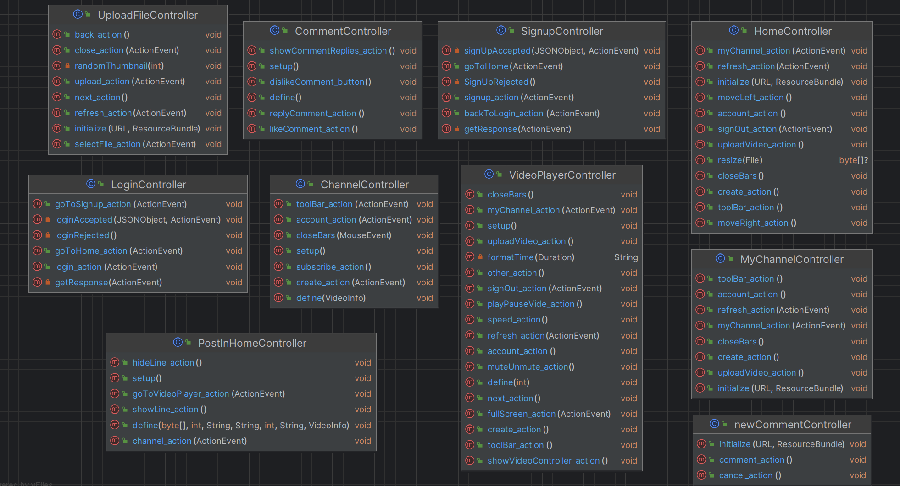
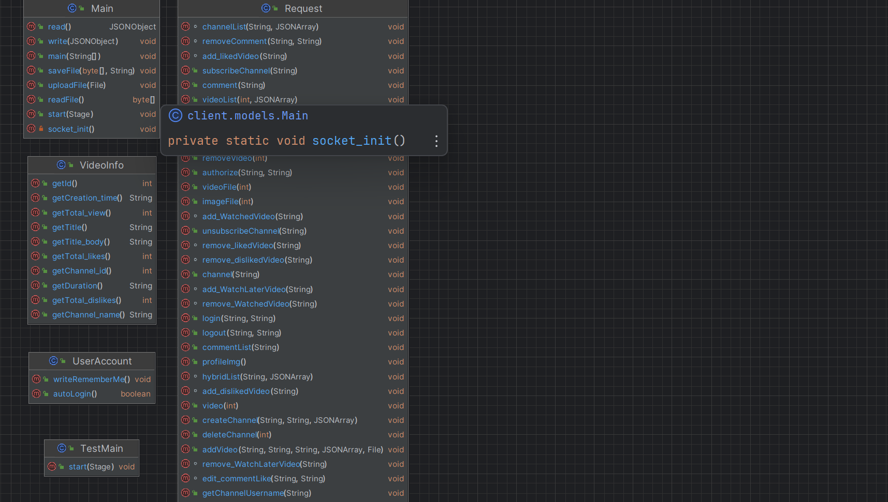
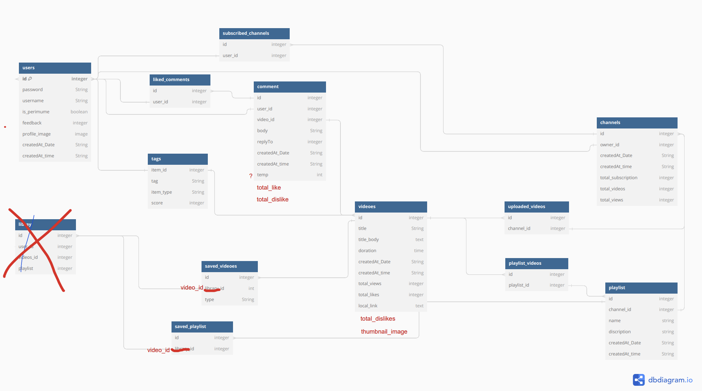
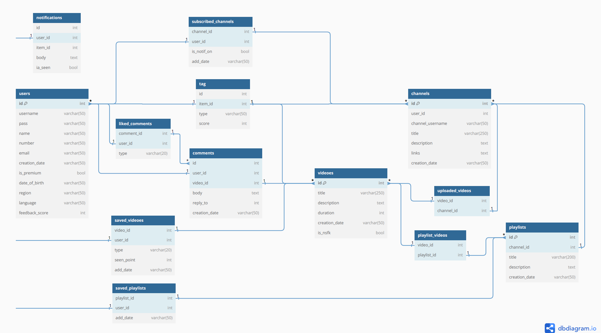

 # YouTube Project
This is a YouTube_like  java project at course Advanced programming on Faculty of Computer Science
in Shahid Beheshti University , Tehran, Iran.
## Pre Requirements
> Note!
> You need to set your JavaFX SDK directory in the Project Structure as shown in the image below.    

## Main Tasks
The server is designed to handle multiple clients using multi-threading. We employed OOP (Object-Oriented Programming).
The most challenging part of the project was streaming video to the user.

## UML Design
### Client 
* Controllers  
  * Methods    
    
  * Fields   
    

* Models   
  * Methods    
    

## Database Diagrams
- Database Diagram V1   
  

- Database Diagram V2   
  

- Database Diagram Final version   
  

### server 
* DBM Methods    
  
  
 
## GUI 
The main tool for designing the graphical user interface for this project is JavaFX. The stages, scenes,
and all other JavaFX components were created using [Scene Builder](https://www.oracle.com/java/technologies/javase/javafxscenebuilder-info.html).
Additionally, we used some HTML and CSS for the interface design.

## Objectives
Here is a list of concepts used throughout the project:
- Using OOP concepts
- Database design
- Multithreading concepts
- Socket Programming
- Designing graphical user interface with JavaFX
  
## implementation
The project has 3 main parts: 
1. `YouTubeClient`  
2. `YouTubeServer` 
3. `Sockets`
4. `DBM`
- `YouTubeClient`
  This package serves as the interface/app layer of the project. It is responsible for getting input from a client, sending it through a socket to the server, and waiting for a response.
  The process of uploading a video is similar to the process of showing a video to the user, as explained below.
- `YouTubeServer`

  The server is responsible for reading requests from each client, responding directly or accessing the database using DBM class methods,
  and then responding back to the client. The server can handle multiple requests simultaneously, 
   and a server log is printed to the terminal to show the server's activities.
  -  Process of sending video to the client:
    - We send the data in 4-kilobyte packets. Before sending the packets, the server sends the video size to the client, so it can verify that all packets are received correctly.
      We don't stream videos due to unresolved bugs. Once the video is completely sent and saved as a file in resources/CACHE, it will be read and played for the user. For profile and channel images, the image is sent as a byte array, 
     and a method on the client side converts this byte array to display the image.
    
- `Sockets`
  All data exchanged between each client and the server is done through sockets. 
   Each request from the client is sent through a socket, received by the server, and responded to properly through the same socket for each client.
- `Database`   
  We stored data in an SQL database (except for videos, profile images, and channel images, which are stored in the resources) using MySQLServer and MySQLWorkbench. All methods that read, write, modify, and delete data in the database are in
  the DBM (Database Manager) class.
  Some notes about storing data in the database :
  - Don't ever use comma(,) to seperate data and put multiple data in one cell.
  - Close every connection at the end of each method to prevent potential bugs. Do not define a static Connection for
    use throughout the class methods.

##  Recommendation System and Tags
our recommendation algorithm has designed to reach the most compatibility between user preferences and its home feed. We tried to personalize user's home feed based on
which contents has watched more before and which videos were liked by the user.To reach this goal we assign every user and every video some tags such as "action" , "romance"
, "nature", "tech" ,etc.For each tag we have a score between 0 and 100. The more you like and watch videos with "action" tag, your score on "action" tag get nearer to 100. And you 
will get more videos with this tag in your home feed.More score on "action" tag  of a video means the video have more related action scenes in there.  . very tag has  , when a user
likes a video or watch it, the user's tags increase based on the scores of the user's tag.
when subscribes a channel , it means there is a more powerful relation between the user preferences and the channel's video's content. So it must affect  o the user's tags score 
more than the time user just likes a video .  
The tags of the video is assigned by the user at the uploading point. 

# Search algorithm
we used levenstein distance which  takes into account the number of insertion, deletion and substitution operations needed to transform one string into the other. 
the problem of levenstein distance of the words "hey" and "abc" is 3. but the distance of the words"hey" and "heyman" is 6.bat "abc" has no relation with"hey".So we can't only depen on levenstein ditance.
We first filter by  regex, the way that if the title in database contained "hey"(even in the middle of the title) then we calculate the filtered
titles levenstein distance.
## Contributers 
Mentor : Mobina Kargar [telegram](https://t.me/moodygr) || [GitHub](https://github.com/Grmamobin)
Mahan Tahmasebi [telegram](https://t.me/mahan_thm) || [GitHub](https://github.com/mahan-thm)  
Mohammad Hosain Jaafari [telegram](https://t.me/MmdHo3ain) || [GitHub](https://github.com/MmdHosain)  
Kourosh Mojdehi[telegram](https://t.me/kouroshmojdehi) || [GitHub](https://github.com/kourosh-mojdehi)
